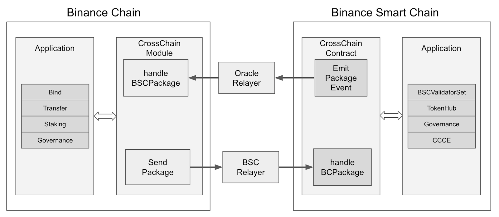

# Overview

Oracle Relayer is responsible for relaying events of Axim Smart Chain to Axim Chain. 

## Design

Oracle Relayer fetches blocks from ASC one by one and save `crossChainPackage` events to 
database. Once the block of events is confirmed by ASC for a number of 2/3 validator amount blocks, 
Oracle relayer will relay the events to Axim Chain.

There are two sequence related to cross-chain events:
+ `OracleSequence`: `OracleSequence` is used to control the batch length of events to be relayed to 
Axim Chain. For example, there are `n` cross-chain events in one block, and the batch length of events 
is `m`(which is controlled by ASC), there may be `n/m+1` unique `OracleSequence` in those events so that 
Oracle Relayer can relay all the events to Axim Chain in `n/m+1` batches. To sum up, Oracle Relayer will
relay all the events with the same `OracleSequence` to Axim Chain in one batch and `OracleSequence` is increased
one by one and will be checked in Axim Chain.
+ `PackageSequence`: `PackageSequence` is the sequence of each event type which is also increased 
one by one.

To improve the performance of cross-chain communication, Oracle Relayer relays a batch of
events which with the same `OracleSequence` to Axim Chain instead of one by one. 